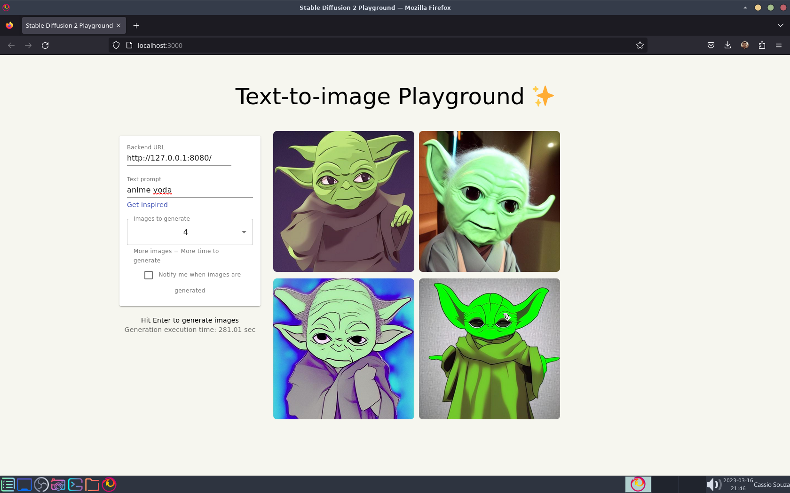

<h1 align="center">
  Docker Stable Diffusion 2
</h1>

<h4 align="center">A fork from <a href="https://github.com/saharmor/dalle-playground">dalle-playground</a> using Stable Diffusion 2 for CPU</h4>

<p align="center">
  <a href="#about">About</a> •
  <a href="#usage">Usage</a> •
  <a href="#credits">Credits</a> •
  <a href="#license">License</a>
</p>



## About

This repository is a fork from [dalle-playground](https://github.com/saharmor/dalle-playground) that uses Stable Diffusion 2 in CPU only.

## Usage

Run in your terminal ``docker compose up``, wait the install and you can access from your browser [Website](http://localhost:3000/) on ``http://localhost:3000/``. On the website put this on backend url ``http://127.0.0.1:8080/``. To shutdown the application run ``docker compose down``.

### Manual install

```sh
python -m venv venv

. venv/bin/activate

pip install -U pip

pip install torch torchvision torchaudio --index-url https://download.pytorch.org/whl/cpu

pip install "jax[cpu]"

pip install diffusers transformers accelerate scipy safetensors

pip install Flask

pip install flask-cors

pip install flask-restful
```

## Credits

Thanks for the open source projects bellow:

- [Docker](https://github.com/docker)
- [Python](https://github.com/python)
- [NodeJS](https://github.com/nodejs)
- [dalle-playground](https://github.com/saharmor/dalle-playground)
- And many others one listed on [requirements.txt](backend/requirements.txt) and [package.json](frontend/package.json)

## License

MIT
